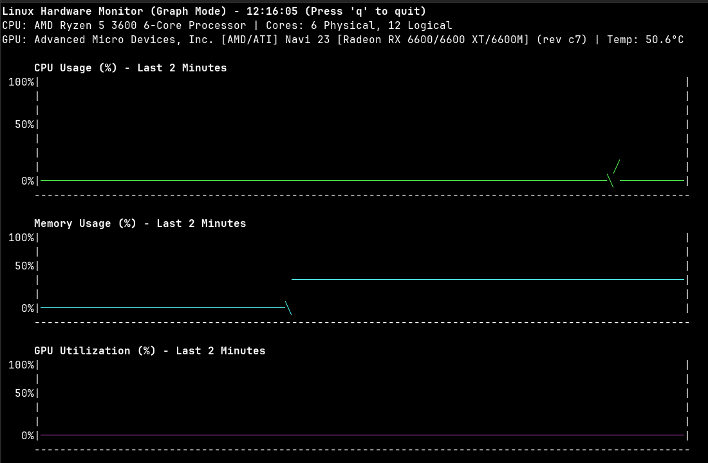

# Linux Hardware Monitor

A comprehensive Python-based system monitoring tool for Linux that provides real-time hardware metrics similar to hwinfo64. Features both text-based and graphical interfaces for monitoring CPU, GPU, memory, and disk usage.

## Features

### Real-time Monitoring
- **CPU Information**: Model name, core count, frequency, per-core usage, and temperature
- **GPU Support**: NVIDIA and AMD GPU detection with utilization, memory, temperature, and power draw
- **Memory Monitoring**: System RAM usage with detailed statistics
- **Disk I/O**: Real-time disk usage, I/O statistics, and filesystem information
- **Historical Data**: 2-minute rolling history for all metrics

### Display Modes
- **Standard Mode**: Detailed text-based display with color-coded usage bars
- **Graph Mode**: Real-time line graphs showing metric trends over time
- **Neofetch Mode**: System information display in neofetch-like format
- **CSV Recording**: Export metrics to CSV files for analysis

### Advanced GPU Detection
- **NVIDIA**: Full support via nvidia-smi with temperature, utilization, memory, and power
- **AMD**: Multi-layer detection system:
  - Vendor ID checking via `/sys/class/drm/card*/device/vendor`
  - lspci fallback detection
  - ROCm support for detailed metrics
  - Sysfs fallback for basic utilization

## Requirements

### Core Dependencies
- Python 3.10+ with psutil
- ruff (for code formatting/linting)

### GPU Support (Optional)
- **NVIDIA GPUs**: `nvidia-smi` command-line tool
- **AMD GPUs**: `rocm-smi` for detailed metrics (basic support works without)

## Usage

### Running the Application
```bash
uv run main.py                   # Standard monitoring mode
uv run main.py --graph           # Graph mode with historical data
uv run main.py --neofetch        # Display system info in neofetch-like format
uv run main.py --record          # Record metrics to CSV
uv run main.py --output file.csv # Custom CSV output file
```

### CLI Arguments
- `--graph` or `-g`: Run in graph mode with historical charts
- `--neofetch` or `-n`: Display system information in neofetch-like format
- `--record` or `-r`: Record metrics to CSV file for analysis
- `--output` or `-o`: Specify output CSV filename (default: hw_metrics.csv)

### Graph Mode Features
Real-time line graphs showing 2-minute historical data:
- CPU usage trends
- Memory usage patterns
- GPU utilization history (if available)
- GPU memory usage trends (if available)
- Disk usage monitoring




## Technical Implementation

### Architecture
- **SystemMonitor Class**: Core hardware detection and metrics collection
- **Caching System**: 60-second GPU detection cache to minimize system calls
- **Graceful Degradation**: Missing GPU tools don't crash the application
- **Multi-source Data**: Combines multiple system interfaces for comprehensive metrics

### GPU Detection Logic
1. **NVIDIA Detection**: Uses nvidia-smi for comprehensive metrics
2. **AMD Detection**: Multi-layered approach:
   - Primary: Vendor ID verification via sysfs
   - Secondary: lspci parsing for device identification
   - Metrics: ROCm tools for detailed info, sysfs fallback for basic usage

### Performance Features
- **Efficient Polling**: 1-second refresh rate with minimal system impact
- **Terminal Safety**: Automatic bounds checking and resize handling
- **Memory Efficient**: Rolling deque for historical data storage

## Development

### Code Quality
```bash
uv run ruff check .     # Lint code
uv run ruff format .    # Format code
```

### Logging
The application logs GPU detection issues and errors to `hw_monitor.log` for debugging.

## Compatibility Notes

### AMD GPU Support
AMD GPU metrics availability depends on your specific hardware and drivers:
- **Temperature**: Varies by card model and hwmon support
- **Memory Usage**: Requires ROCm tools for detailed metrics
- **GPU Utilization**: May not be available on older cards/drivers
- **Device Detection**: Automatically handles multiple GPU cards

### System Requirements
- **Minimum Terminal**: 80x25 for standard mode, 100x35 for graph mode
- **Permissions**: Some GPU metrics may require elevated permissions
- **Dependencies**: Works with standard Linux utilities, enhanced with GPU tools

## Links
- [ROCm Installation Guide](https://rocm.docs.amd.com/projects/install-on-linux/en/latest/install/quick-start.html)
- [NVIDIA Driver Installation](https://docs.nvidia.com/cuda/cuda-installation-guide-linux/)

